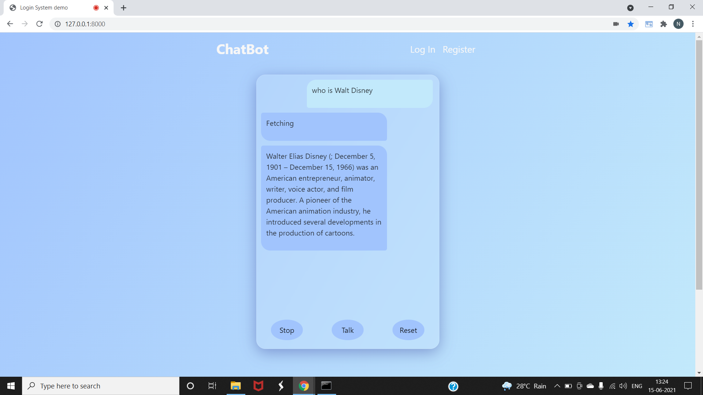
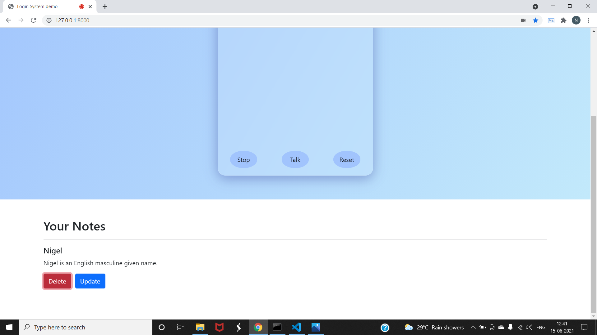

# wikipedia-chatbot
The aim of this project is to create a virtual information chat-bot, thus developing a chatbot that will give us required information using Wikipedia's open source API, by conversing and interacting with us. 
Speech recognition is accessed via the [SpeechRecognition](https://developer.mozilla.org/en-US/docs/Web/API/SpeechRecognition) interface whereas Speech synthesis is accessed via the [SpeechSynthesis](https://developer.mozilla.org/en-US/docs/Web/API/SpeechSynthesis) interface
### Objectives:
1. Create an interactive and fun environment for getting information from Wikipedia.
2. Using experimental [Web Speech API](https://developer.mozilla.org/en-US/docs/Web/API/Web_Speech_API).
3. Give logged in users option to save the fetched information
### How to use:
1. click talk button and say the keywords of 'search for' to search,  *search for **'word'***  
2. to search for people, say the keywords of 'who is',   *who is **'name_surname'***  
3. The stop button will stop the chatbot from talking.
4. the reset button will reset the SpeechRecognition and SpeechSynthesis.
### Demonstration:
**1. Guest users** can use the chatbot, however they cannot save fetched information

using keywords 'search for'

using keywords 'who is'

**2. Registeration page** 

**3. Login page**

**4. Authentication Errors**

**5. On successful login**

**6. Adding notes**, saving information fetched

**7. Updating notes**

**8. Deleting notes**

